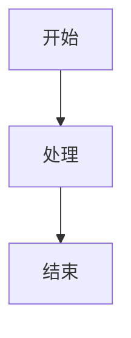
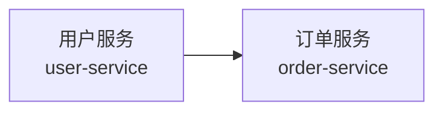
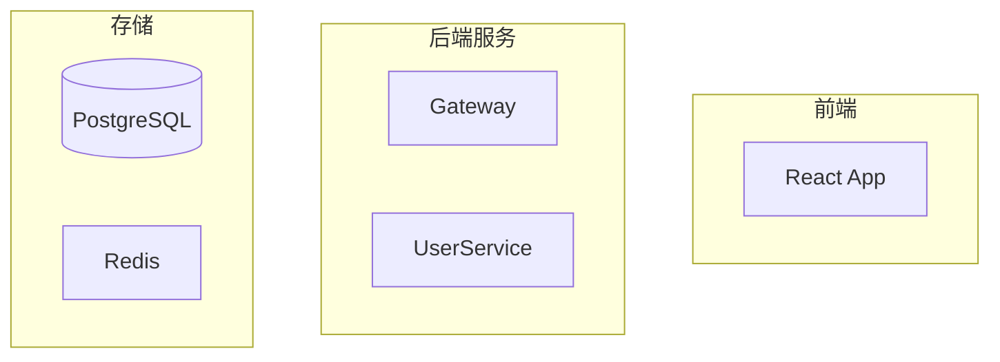

# Mermaid 图表绘制

帮助绘制清晰、专业、易于阅读的 Mermaid 图表。核心目标是让图表「一眼看懂」，而非堆砌信息。

## 默认输出风格

Mermaid 图表默认使用纯文字标签，不使用 Emoji、图标字符或装饰性符号。只有用户明确要求使用 Emoji 或图标时，才可以添加。

## 图类型选择

根据要表达的信息选择最合适的图类型：

| 要表达的内容 | 推荐图类型 | Mermaid 声明 |
|---|---|---|
| 流程/步骤/决策 | 流程图 | `graph TD` / `graph LR` |
| 系统架构/模块关系 | 流程图 + subgraph | `graph TB` |
| 请求/调用时序 | 时序图 | `sequenceDiagram` |
| 数据库表关系 | ER 图 | `erDiagram` |
| 类的继承/组合 | 类图 | `classDiagram` |
| 状态转换 | 状态图 | `stateDiagram-v2` |
| 项目进度/排期 | 甘特图 | `gantt` |
| Git 分支 | Git 图 | `gitGraph` |
| 用户旅程 | 旅程图 | `journey` |
| 思维导图 | 思维导图 | `mindmap` |

> 当不确定用哪种图时，**流程图**是最通用的选择。

## 核心布局原则

这些原则决定了图表是否清晰易读。违反它们会导致连线交叉、节点挤压、布局混乱。

### 1. 流向一致性

选定了流向（TD=从上到下，LR=从左到右），所有箭头都应该**顺流向**。如果发现大量箭头逆向，说明节点顺序需要调整。



### 2. 禁用双向箭头 `<-->`

双向箭头会严重干扰 Mermaid 的排版引擎，导致线条交叉。改用两条单向箭头，或者重新思考关系的方向性——大多数交互都有主动方和被动方。

### 3. 短 ID + 描述标签

节点 ID 用短前缀（`A1`、`S2`、`DB1`），标签文本写人能读懂的描述。这让源码好维护、排版也更稳定。



### 4. 用 `<br/>` 让节点变高不变宽

长文本一定要用 `<br/>` 换行（控制在 2-3 行），避免单行撑宽整个图的布局。

> **绝对不要用 `\n` 换行** — Mermaid 不支持 `\n`，只认 `<br/>`。这是最常犯的错误。

### 5. 用 `~~~` 隐形链接强制排序

子图内没有连接关系的节点会被 Mermaid 挤到同一行。用 `A ~~~ B` 创建不可见的排序关系，强制纵向排列。

### 6. 慎用 `direction LR`

仅当子图内 ≤3 个节点且文字短时使用。4+ 个节点或长文字的子图用 `direction LR` 会撑得极宽。

### 7. 子图内部连接写在 subgraph 块内

把链式调用写在 subgraph 定义内部（如 `A1 --> A2`），帮助 Mermaid 理解内部流向并正确排版。

### 8. 节点多时调整间距

多行节点时加上 config 头控制间距：
```
---
config:
    flowchart:
    nodeSpacing: 20
    rankSpacing: 40
---
graph TD
    ...
```

## 样式与可读性

### subgraph 分层

用 subgraph 将逻辑层次分组，标题和节点使用简洁的纯文字：



### 统一配色方案

保持整张图配色一致，用 `style` 给 subgraph 上色：

| 层次 | 背景色 | 边框色 | 用途 |
|------|--------|--------|------|
| 外部系统/用户 | `#ffebee` | `#c62828` | 红色系 |
| 网关/接入层 | `#f3e5f5` | `#7b1fa2` | 紫色系 |
| 业务服务 | `#e8f5e9` | `#2e7d32` | 绿色系 |
| 数据存储 | `#e3f2fd` | `#1565c0` | 蓝色系 |
| 消息队列 | `#fff3e0` | `#f57c00` | 橙色系 |
| 基础设施 | `#fce4ec` | `#c62828` | 粉色系 |

```mermaid
style Client fill:#ffebee,stroke:#c62828
style API fill:#e8f5e9,stroke:#2e7d32
style Storage fill:#e3f2fd,stroke:#1565c0
```

### 连线标注

连线上标注协议/格式/关键信息，但文字要**短**（≤8字）：

```mermaid
A -->|"HTTP POST"| B
B -->|"Kafka JSON"| C
C -->|"gRPC"| D
```

## 渲染注意事项

1. Mermaid 代码块前后**必须有空行**，否则部分渲染器（GitLab、飞书）不识别
2. **换行只能用 `<br/>`**，绝对不要用 `\n`（Mermaid 不识别 `\n`）
3. 避免在节点标签中使用特殊字符（`()[]{}|`），需要时用引号包裹
4. 中文标签建议用 `["中文"]` 方括号 + 引号形式
5. subgraph 标题中如果含特殊字符也要用引号
6. **mindmap 中不支持引号转义**——mindmap 的节点文本直接就是该行内容，`()[]{}` 会被强制解析为形状语法，无法通过引号绕过。唯一安全做法是**彻底避免这些字符**，改用 `/`、`-`、`·` 等替代。例如 `固定车-月卡管理` 而非 `固定车(月卡)管理`

## 图的规模控制

一张图的信息密度应该是「扫一眼能抓住要点」。如果节点超过 15-20 个，考虑：

1. **分拆成多张图** — 一张总览图 + 若干细节图
2. **用 subgraph 收纳** — 把同层的节点归入一个 subgraph，只暴露关键接口节点
3. **省略非核心路径** — 用 `...` 或注释说明被省略的部分

## 各图类型的详细模板

详见 `references/` 目录下的参考文件：

| 文件 | 内容 |
|------|------|
| `references/flowchart.md` | 流程图（含决策分支、并行、循环模式） |
| `references/sequence.md` | 时序图（含分组、循环、条件、注释） |
| `references/er-and-class.md` | ER 图和类图 |
| `references/other-types.md` | 状态图、甘特图、旅程图、思维导图等 |

当需要画某种特定类型的图时，读取对应的参考文件获取详细模板和高级用法。
