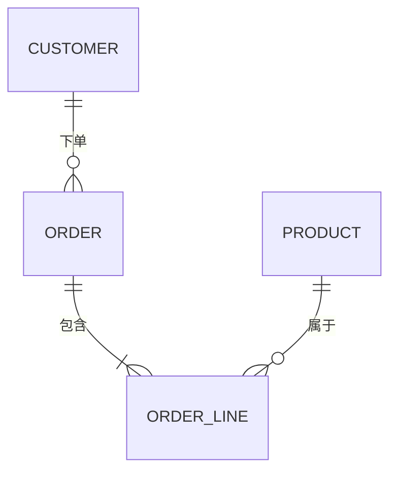
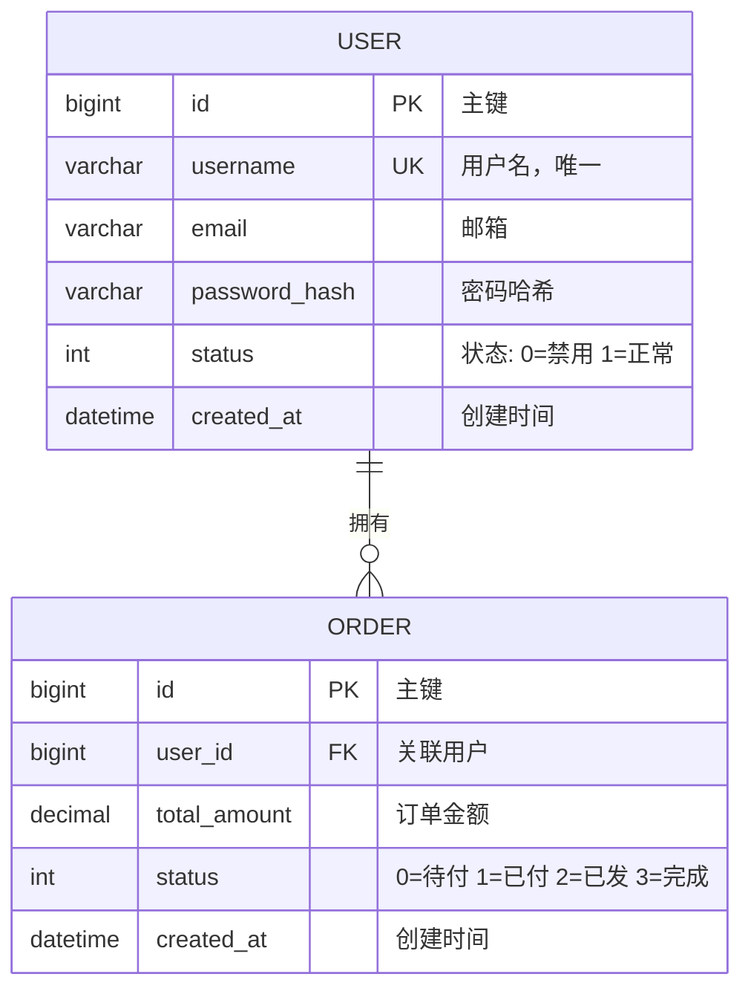
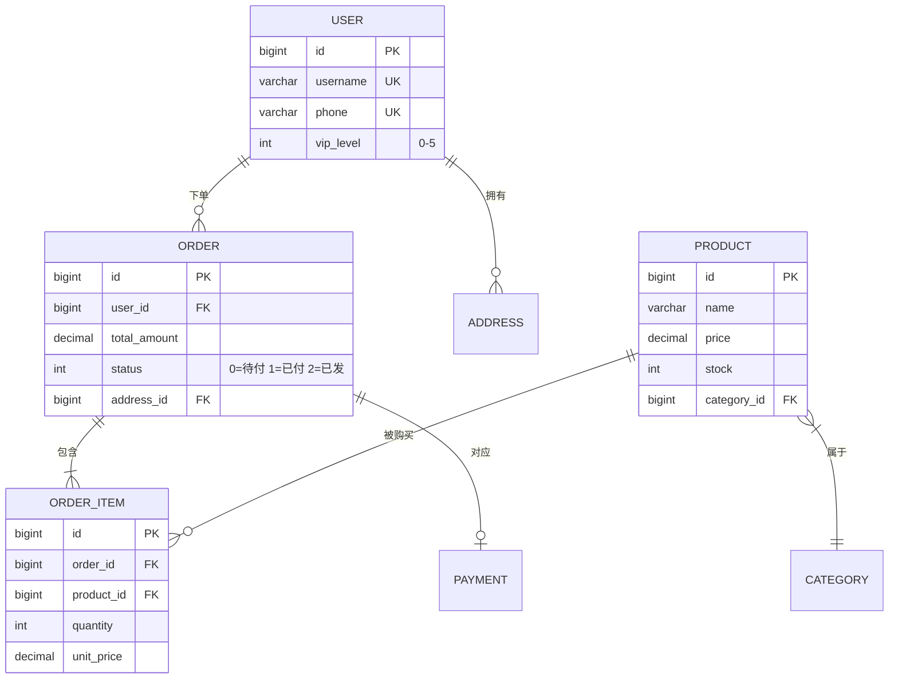
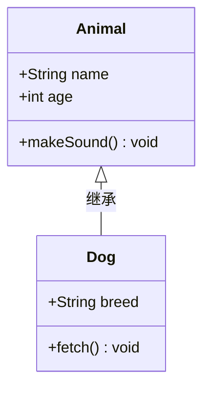
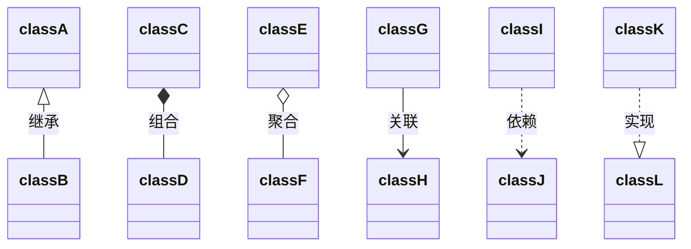
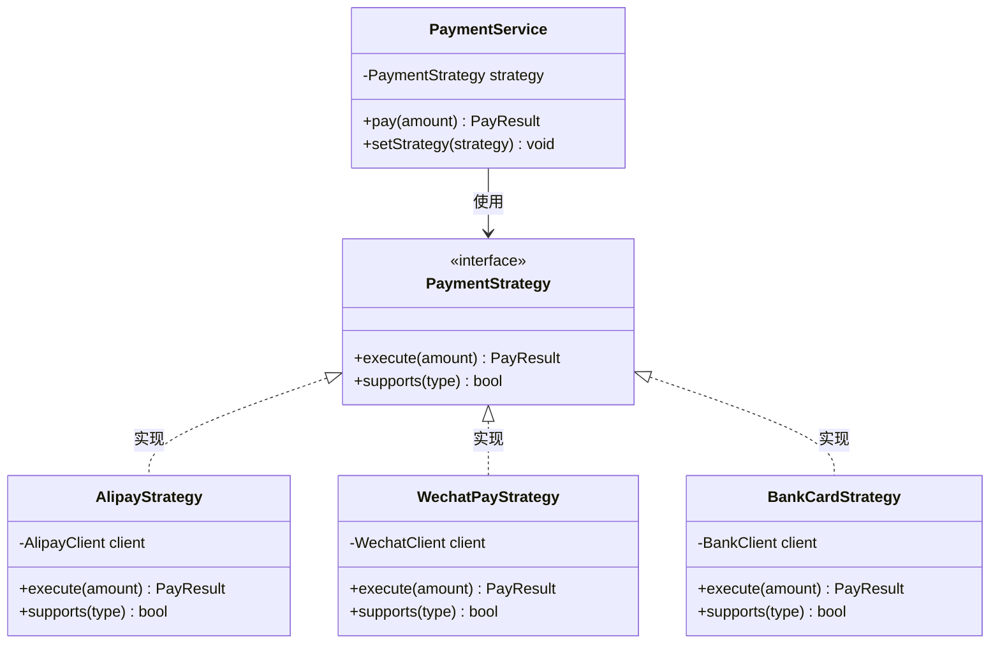
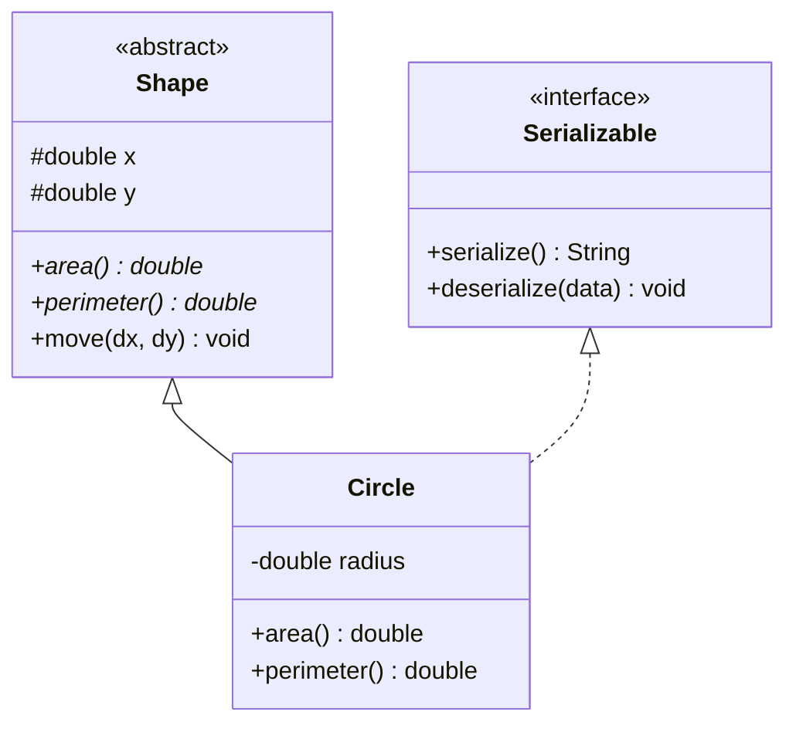
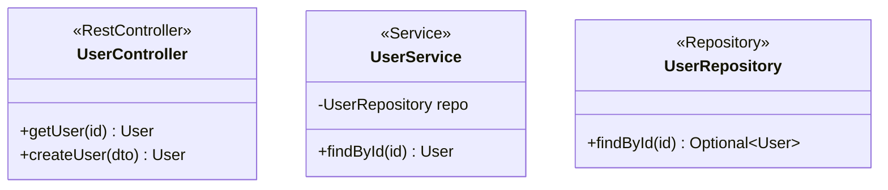
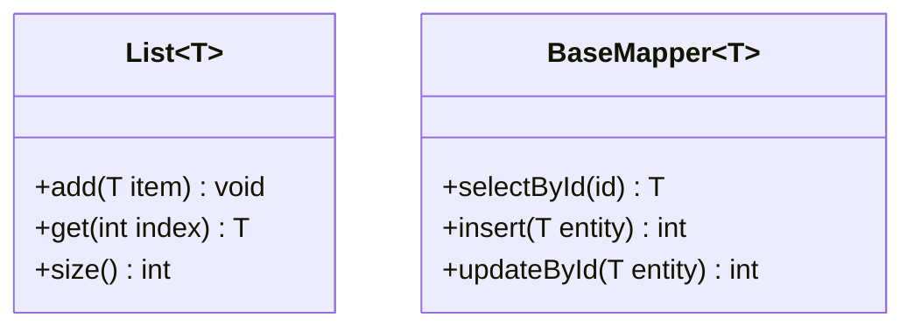

# ER 图和类图参考

## ER 图 (Entity Relationship Diagram)

### 基本语法

### 关系类型

| 语法 | 含义 | 说明 |
|------|------|------|
| `\|\|--\|\|` | 一对一 | 两端都是恰好一个 |
| `\|\|--o{` | 一对多 | 左边一个，右边零或多个 |
| `\|{--\|\|` | 多对一 | 左边一个以上，右边恰好一个 |
| `o{--o{` | 多对多 | 两端都是零或多个 |
| `\|\|--o\|` | 一对零或一 | 左边恰好一个，右边零或一个 |

符号说明：
- `||` = 恰好一个 (exactly one)
- `o|` = 零或一 (zero or one)
- `}|` = 一个以上 (one or more)
- `o{` = 零或多个 (zero or more)

### 实体属性

### 完整示例：电商系统

### ER 图最佳实践

1. **只画核心实体** — 不需要把所有表都放进去，聚焦业务核心
2. **标注关键字段** — PK、FK、UK 标记好，枚举值写在注释里
3. **关系标签用动词** — "下单"、"包含"、"属于" 比 "关联" 更清晰
4. **实体名用大写** — `USER`、`ORDER`（Mermaid ER 的惯例）

---

## 类图 (Class Diagram)

### 基本语法

### 可见性修饰符

| 符号 | 含义 |
|------|------|
| `+` | public |
| `-` | private |
| `#` | protected |
| `~` | package/internal |

### 关系类型

| 语法 | 含义 | 说明 |
|------|------|------|
| `<\|--` | 继承 | 子类 → 父类 |
| `*--` | 组合 | 强拥有，生命周期一致 |
| `o--` | 聚合 | 弱拥有，可独立存在 |
| `-->` | 关联 | 引用关系 |
| `..>` | 依赖 | 使用关系 |
| `..\|>` | 实现 | 实现接口 |

### 完整示例：策略模式

### 抽象类和接口

### 注解标记

### 泛型

### 类图最佳实践

1. **聚焦设计意图** — 不要把所有字段和方法都列出，只展示关键的
2. **标注设计模式** — 用 `<<interface>>`、`<<abstract>>`、`<<Service>>` 等注解
3. **关系不超过 10 条** — 太多关系线会变成蜘蛛网，拆分为多张图
4. **按层分组** — Controller → Service → Repository → Entity
