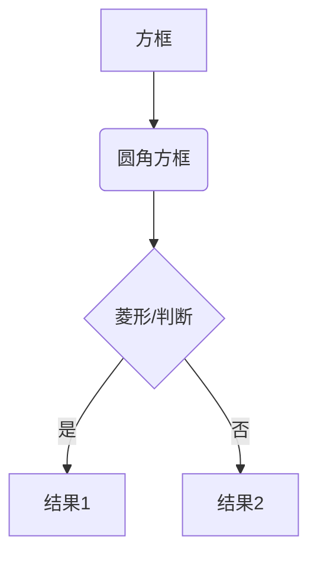
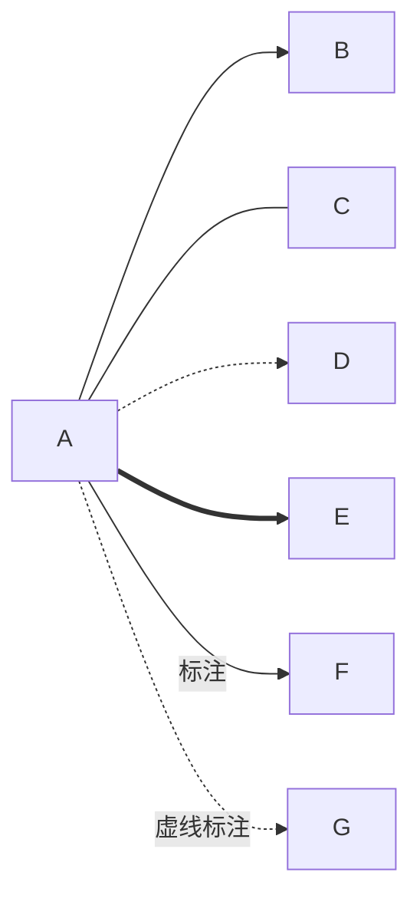
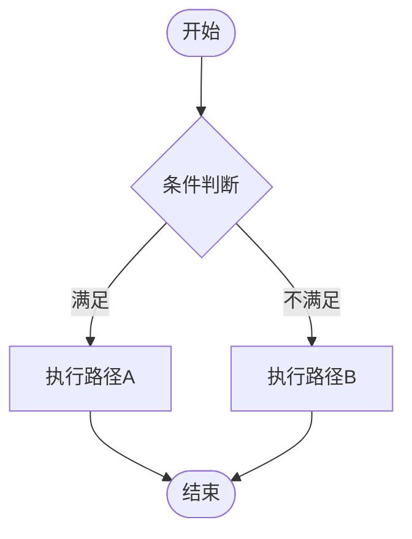
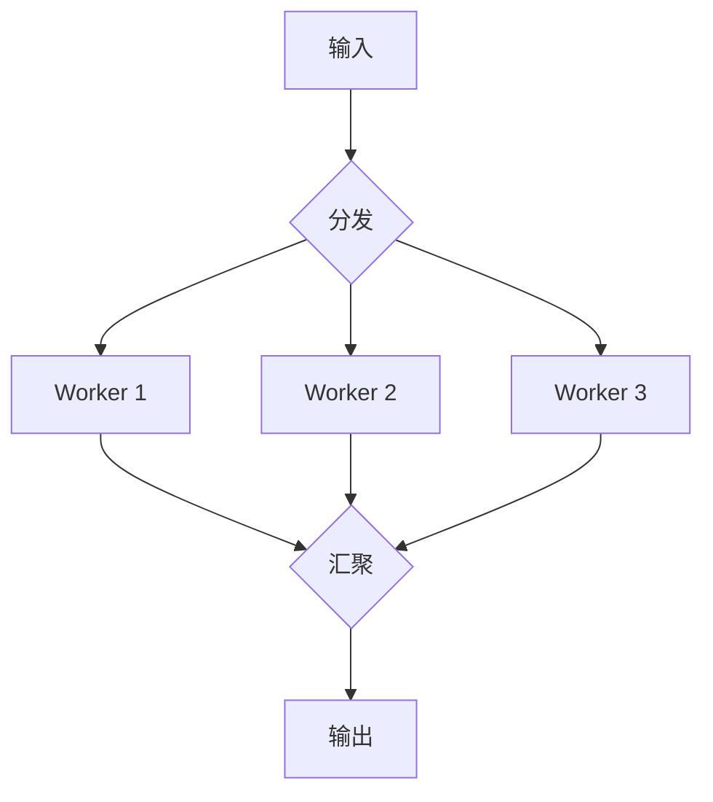
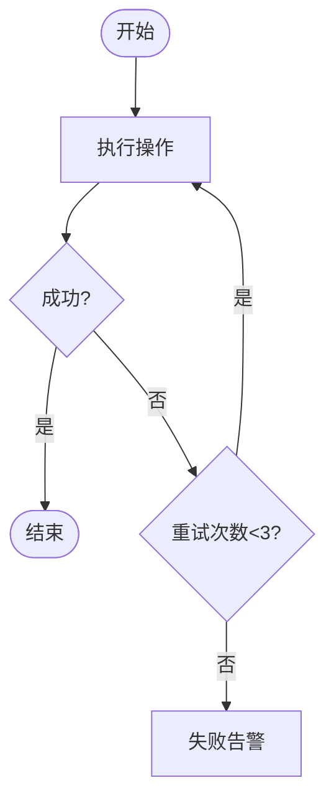
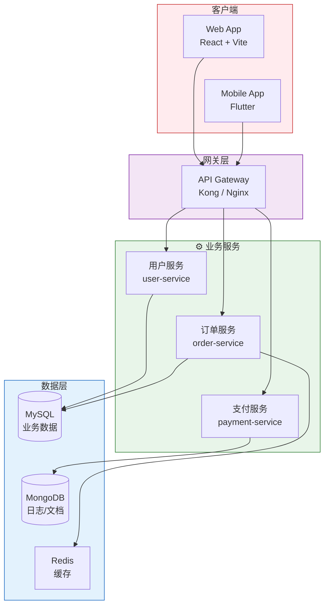
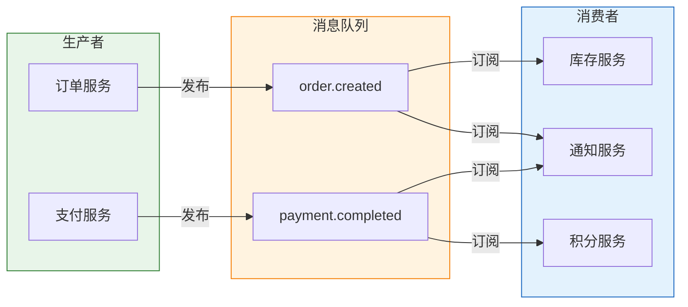
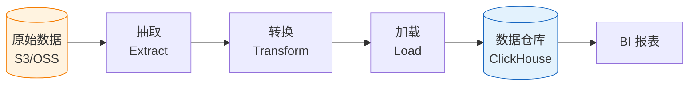
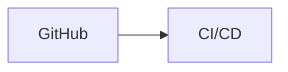
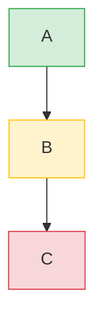

# 流程图 (Flowchart) 参考

## 基本语法



## 节点形状

| 语法 | 形状 | 适用场景 |
|------|------|---------|
| `A[文本]` | 方框 | 普通步骤 |
| `A(文本)` | 圆角框 | 起止/过程 |
| `A{文本}` | 菱形 | 判断/决策 |
| `A([文本])` | 体育场形 | 开始/结束 |
| `A[(文本)]` | 圆柱 | 数据库 |
| `A((文本))` | 圆形 | 连接点 |
| `A>文本]` | 旗形 | 信号/事件 |
| `A{{文本}}` | 六边形 | 准备/条件 |
| `A[/文本/]` | 平行四边形 | 输入/输出 |

## 连线类型



| 语法 | 含义 |
|------|------|
| `-->` | 实线箭头 |
| `---` | 实线无箭头 |
| `-.->` | 虚线箭头（可选/异步） |
| `==>` | 粗线箭头（强调/主流程） |
| `~~~` | 隐形连接（仅布局用） |

## 常见模式

### 模式1：决策分支



### 模式2：并行处理



### 模式3：循环/重试



### 模式4：分层架构图



### 模式5：消息驱动架构



### 模式6：数据处理流水线 (Pipeline)



## 高级技巧

### 用 click 添加交互链接



### 用 class 批量设置样式



### 横向与纵向混合

当需要在纵向流程图中插入横向的子图时：

```mermaid
graph TB
    Start --> subgraph parallel["并行处理"]
        direction LR
        T1["任务1"]
        T2["任务2"]
        T3["任务3"]
    end
    parallel --> End
```

注意：`direction LR` 仅在子图节点 ≤3 个且文字短时使用。
