# 其他图类型参考

## 状态图 (State Diagram)

### 基本语法

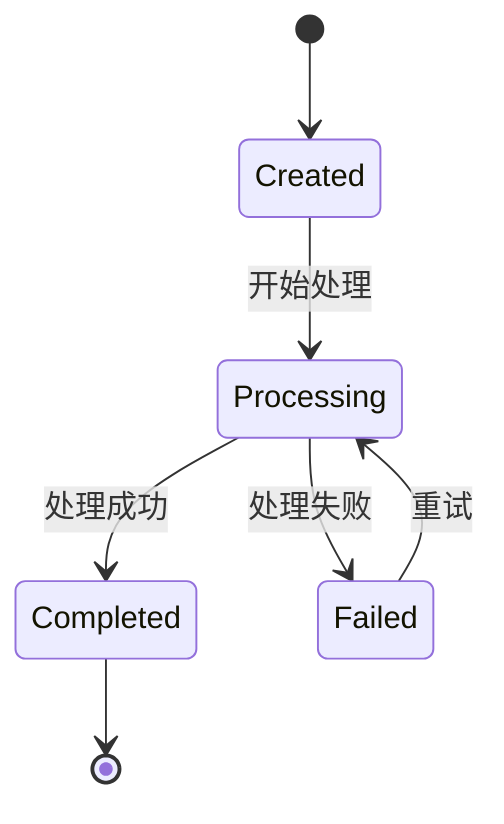

### 复合状态

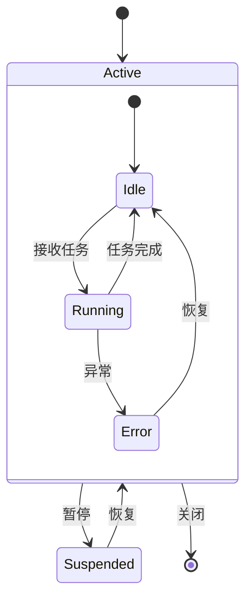

### 并发状态 (fork/join)

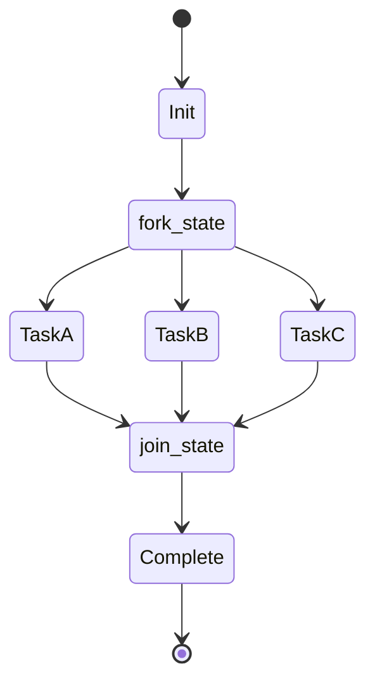

### 带条件的转换

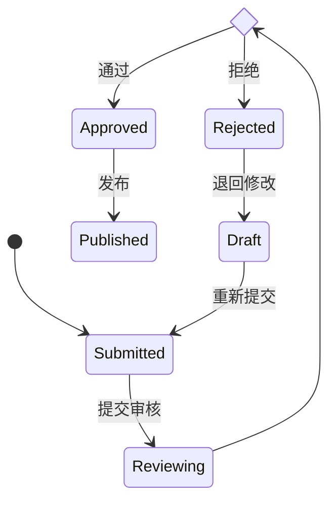

### 完整示例：订单状态机

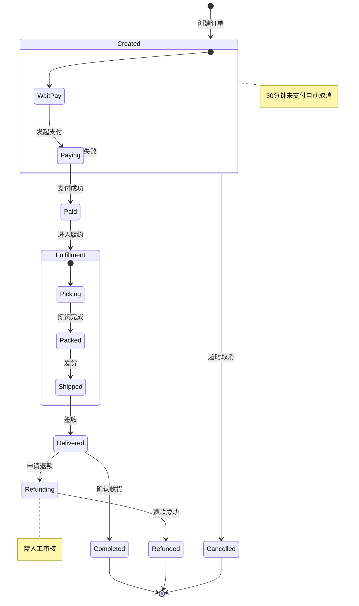

### 状态图最佳实践

1. **用 `[*]` 标记起止** — 让读者知道从哪开始、到哪结束
2. **转换标签用动词** — "提交"、"审核通过" 而非 "状态变为已审核"
3. **复杂状态用嵌套** — 把相关子状态收入复合状态中
4. **标注关键条件** — 超时、需审核等用 `note` 说明

---

## 甘特图 (Gantt)

### 基本语法

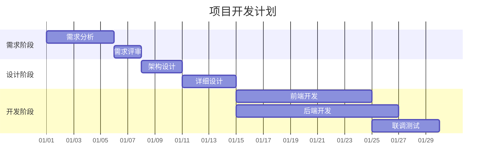

### 任务状态标记

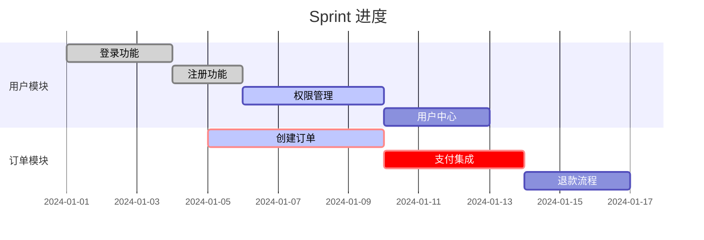

| 标记 | 含义 |
|------|------|
| `done` | 已完成 |
| `active` | 进行中 |
| `crit` | 关键路径(红色) |
| 无标记 | 待开始 |

### 里程碑

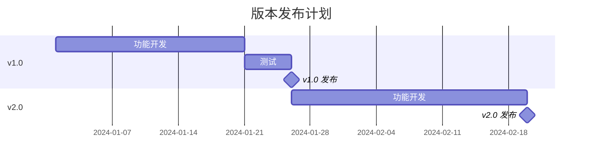

---

## 旅程图 (User Journey)

### 基本语法

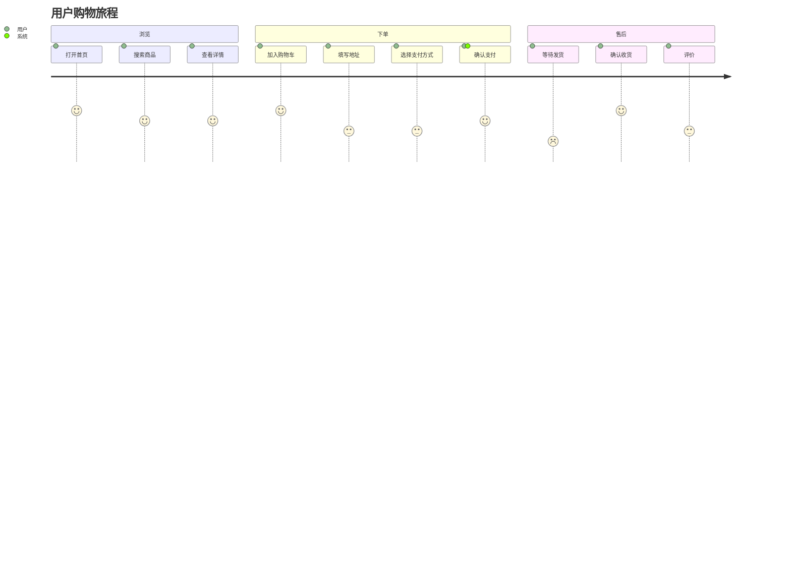

数字 1-5 表示满意度（5=非常满意，1=非常不满意）。

---

## 思维导图 (Mindmap)

### 基本语法

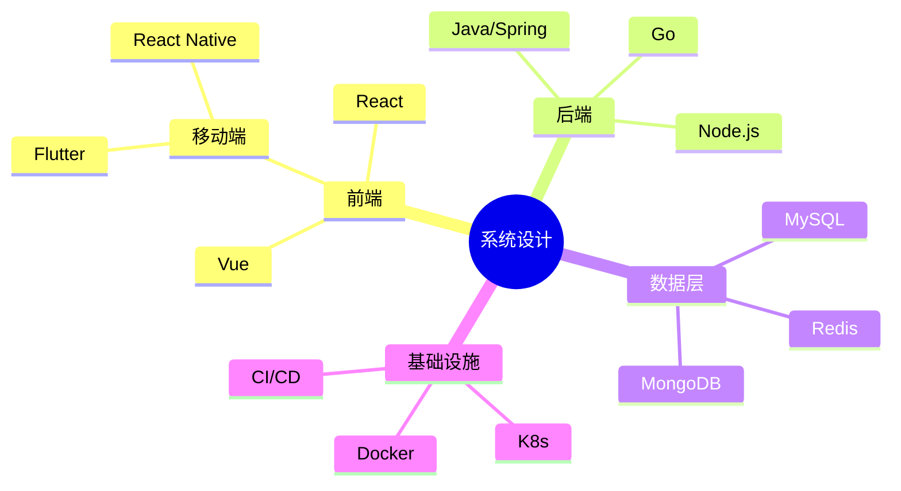

### 带形状的节点

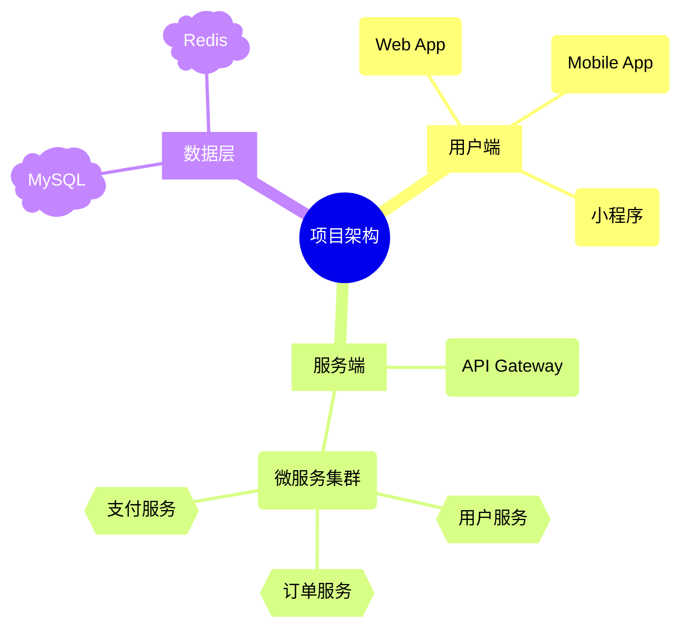

节点形状：
- `(())` 圆形（根节点）
- `[]` 方框
- `()` 圆角框
- `{{}}` 六边形
- `))` 云朵形

### 常见陷阱：特殊字符

mindmap 中**无法通过引号转义特殊字符**（不像 flowchart 可以用 `["文本(含括号)"]`）。节点文本中的 `()[]{}` 会被强制解析为形状语法。

```mermaid
mindmap
    root((错误示例))
        固定车管理
            ❌ 固定车(月卡)管理
            ✅ 固定车-月卡管理
        视频系统
            ❌ 视频监控(IMS)
            ✅ 视频监控/IMS
```

**规则**：mindmap 节点文本中彻底避免 `()`、`[]`、`{}`，改用 `-`、`/`、`·`、`：` 等替代。

---

## Git 图 (GitGraph)

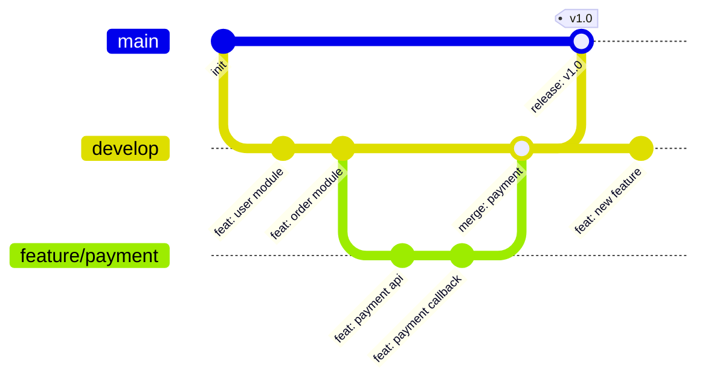

---

## 饼图 (Pie)

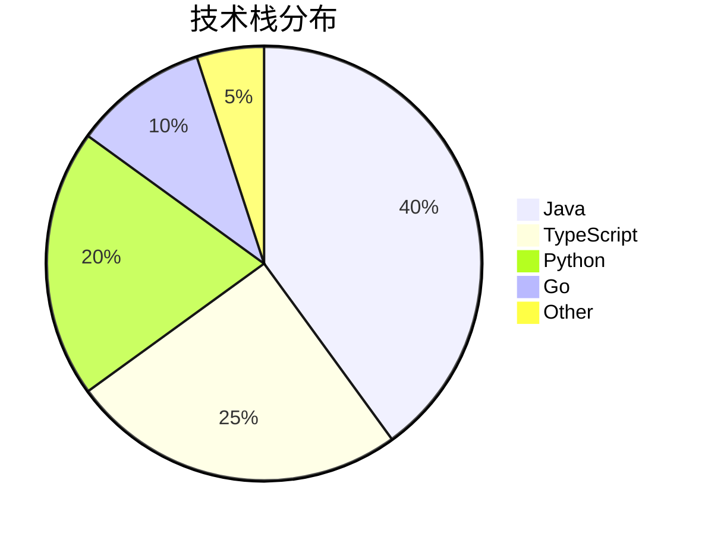

---

## 象限图 (Quadrant)

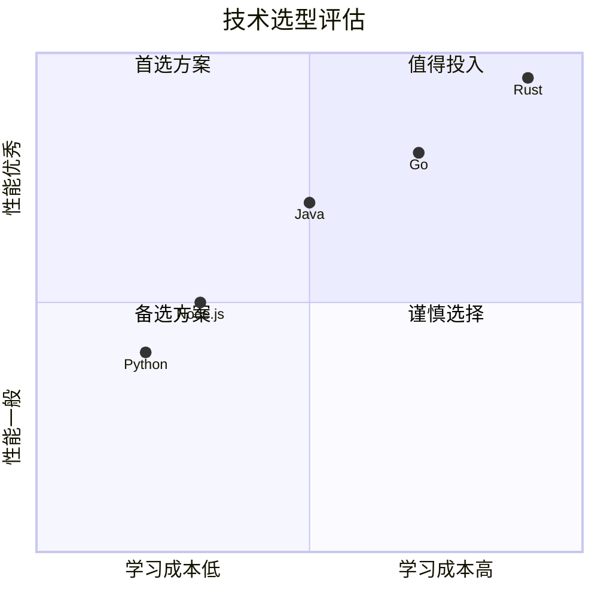
