# 时序图 (Sequence Diagram) 参考

## 基本语法

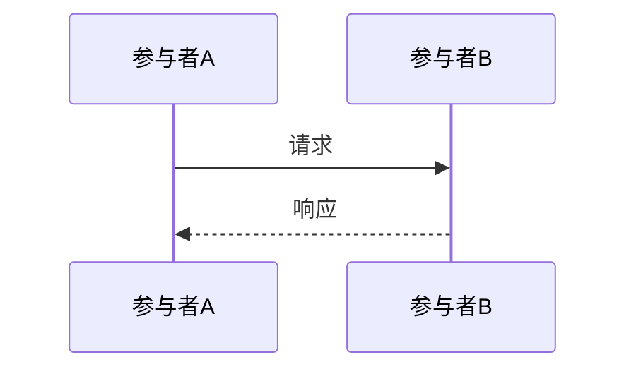

## 消息类型

| 语法 | 含义 | 适用场景 |
|------|------|---------|
| `A->>B: msg` | 实线箭头（同步调用） | API 请求、方法调用 |
| `A-->>B: msg` | 虚线箭头（异步响应） | 返回结果、回调 |
| `A-)B: msg` | 实线开放箭头（异步发送） | 发消息、发事件 |
| `A--)B: msg` | 虚线开放箭头（异步通知） | 推送通知 |
| `A-xB: msg` | 带 × 的箭头（失败） | 请求失败 |

## 参与者声明

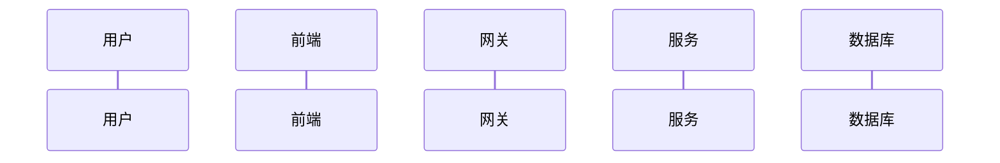

参与者从左到右按声明顺序排列，使用简短的中文别名提升可读性。

## 常见模式

### 模式1：标准 HTTP 请求-响应

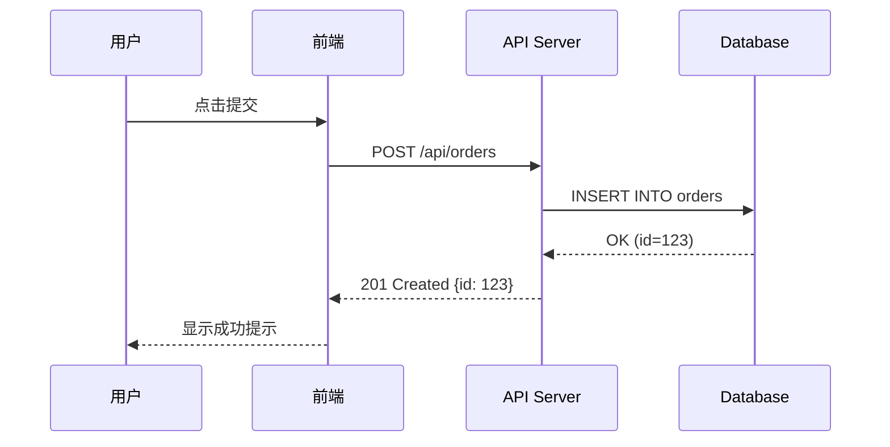

### 模式2：带认证的请求

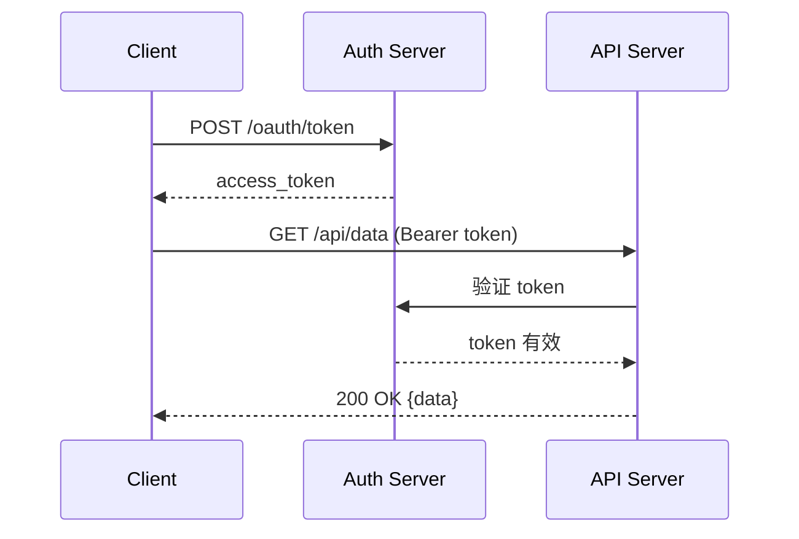

### 模式3：异步消息处理

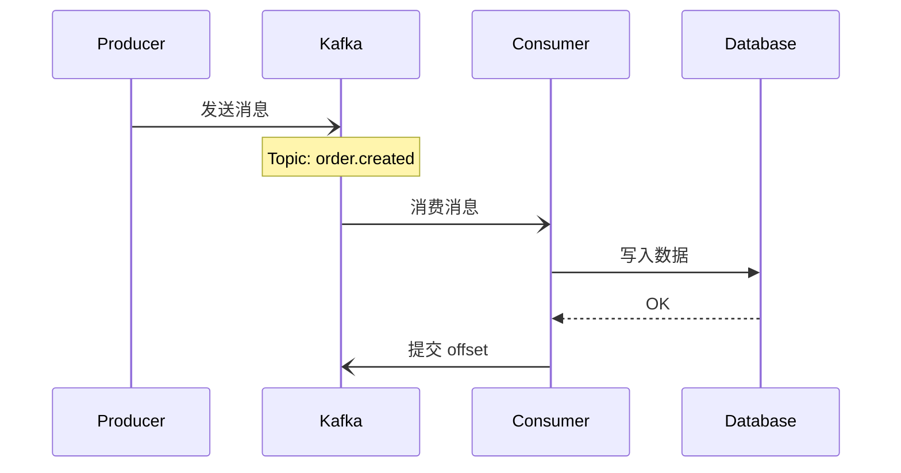

### 模式4：微服务调用链

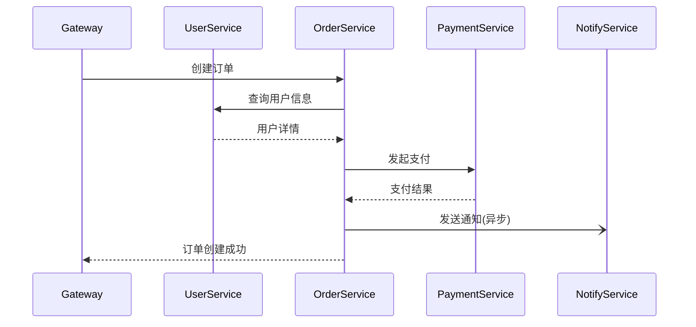

## 高级语法

### 分组框 (rect)

用 `rect` 给一组消息加上背景色框，表示逻辑分组：

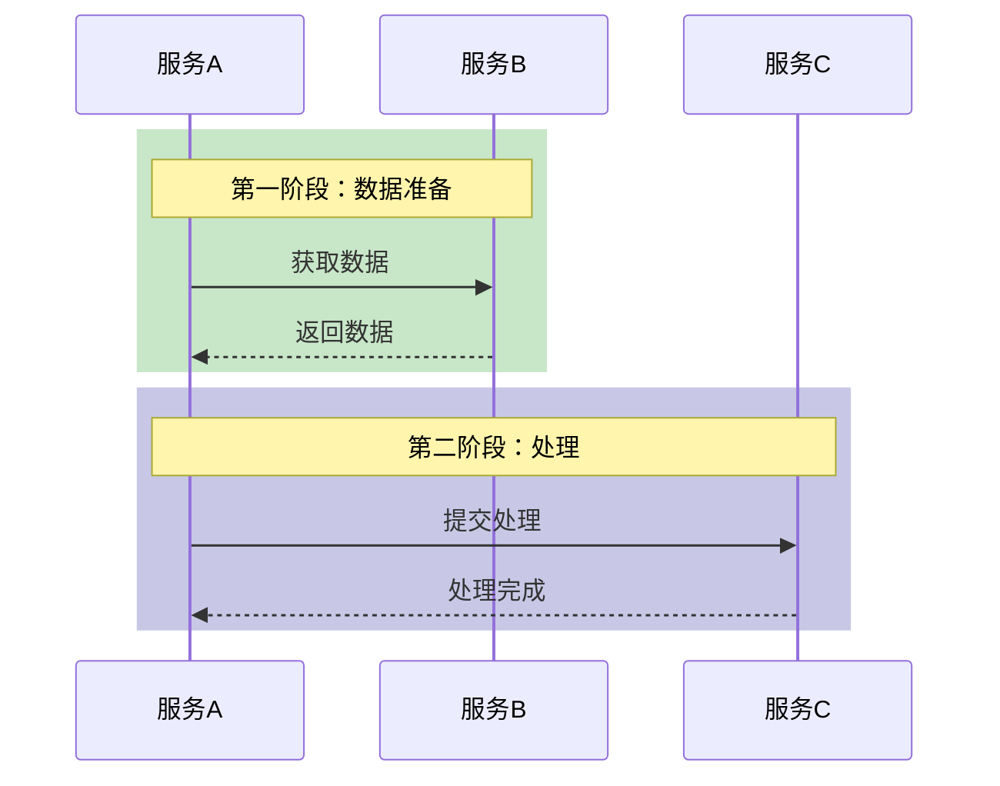

### 循环 (loop)

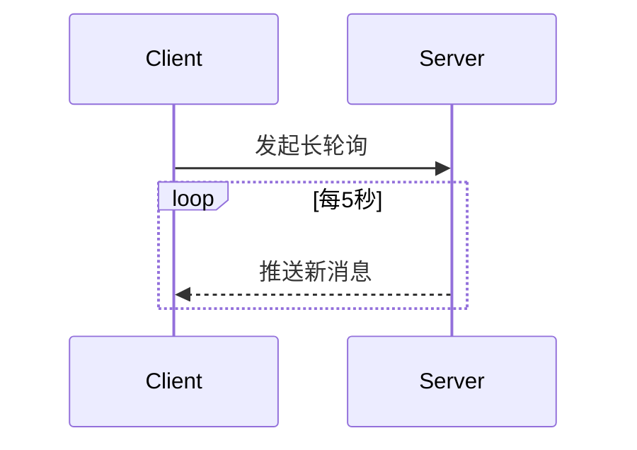

### 条件 (alt/opt)

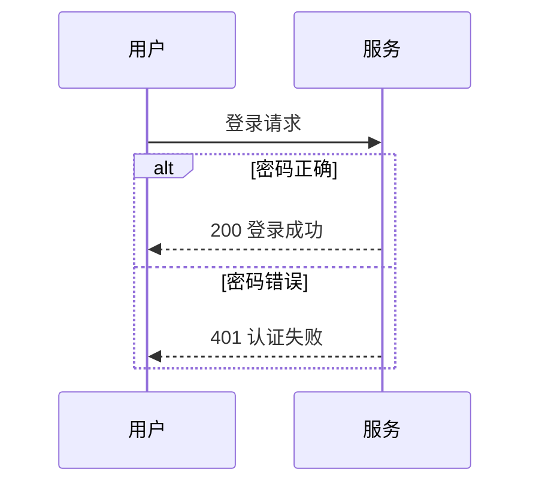

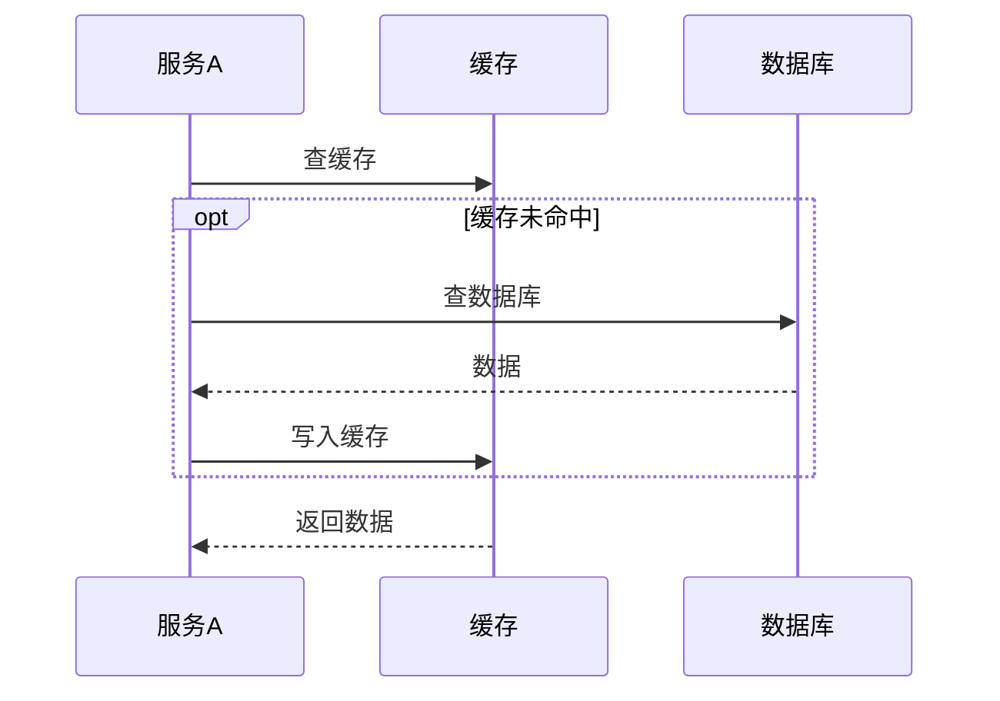

### 并行 (par)

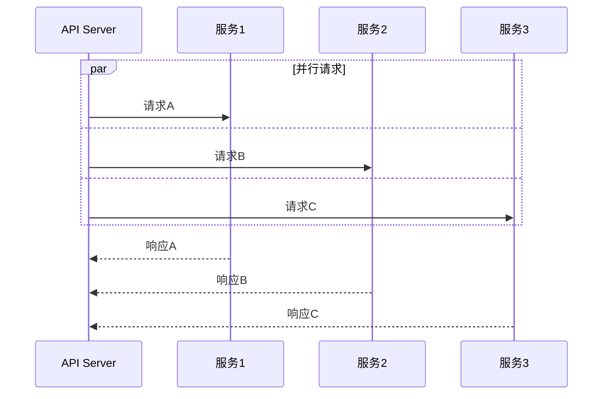

### 注释 (Note)

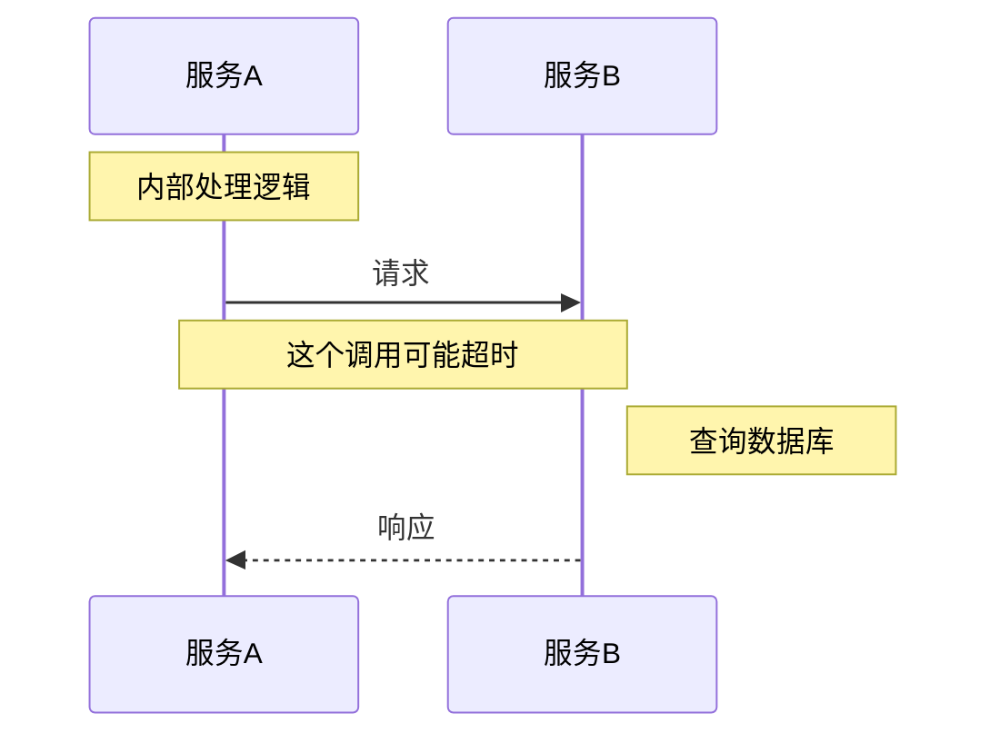

### 激活 (activate/deactivate)

表示参与者的活跃期间：

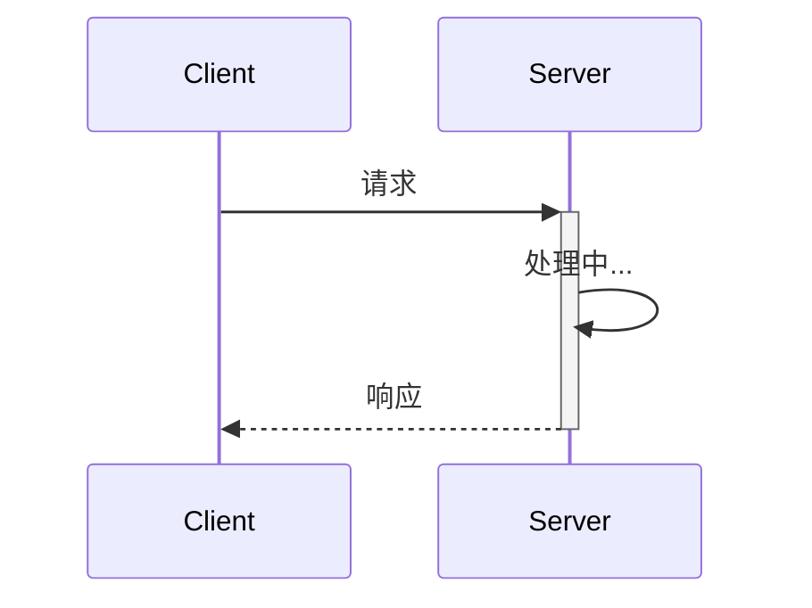

## 时序图最佳实践

1. **参与者不超过 7 个** — 超过时考虑拆分为多张图
2. **从左到右按调用顺序排列** — 让箭头尽量从左指向右
3. **用别名缩短长名称** — `participant OS as OrderService`
4. **标注关键信息** — 请求路径、HTTP 方法、错误码
5. **异步用开放箭头** — 区分同步调用和异步消息
6. **用 rect 分组逻辑阶段** — 比注释更清晰
