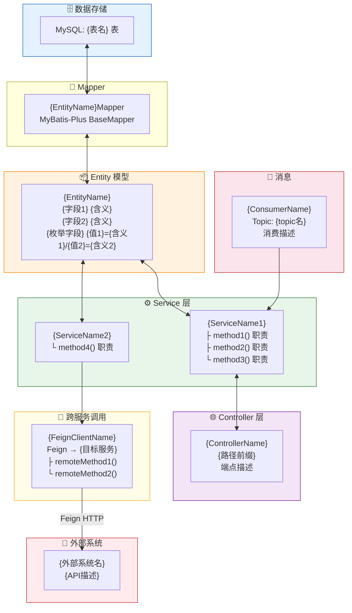
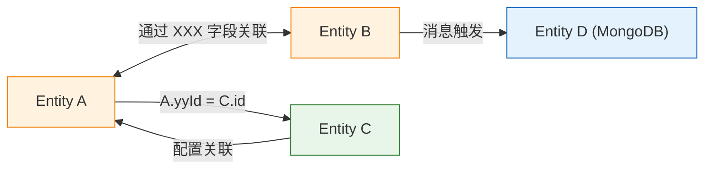

# 从模型出发的链路追踪方法

## 核心思路

Java/Spring 项目天然具有清晰的分层结构。从 Entity 出发，沿着分层架构向上追踪，就能把一个功能涉及的所有代码串起来。

```
Entity（数据是什么）
  → Mapper（数据怎么存取）
    → Service（业务怎么处理）
      → Controller（HTTP 怎么暴露）/ Consumer（消息怎么消费）
        → Feign Client（其他服务怎么调用）
          → 外部系统（最终到达哪里）
```

## 选择核心 Entity 的方法

不是所有 Entity 都值得追踪。选 3-5 个最核心的，标准是：

1. **字段最多** — 字段多说明承载的业务信息多
2. **被引用最多** — 用 grep 搜 Entity 类名，看被多少 Service 引用
3. **跟外部系统直接相关** — 有外部系统 ID 字段的（如 `parkId`、`thirdPartyId`）
4. **用户特别关注的** — 用户提到的模型优先
5. **有状态变化的** — 有 `status`、`state`、`type` 字段的，通常有复杂的状态机逻辑

## 追踪步骤

对每个选中的 Entity：

### Step 1：理解模型本身

读 Entity 类文件，记录：
- 所有字段及其注释（特别是枚举字段的含义）
- 数据库表名（`@TableName` / `@Table` / `@Entity`）
- 特殊注解（`@TableField(exist=false)` 表示非持久化字段）
- 继承关系（是否继承了 `BaseEntity` 等基类）

### Step 2：找 Mapper

搜索 `{EntityName}Mapper` 或 `{EntityName}Repository`：
- MyBatis-Plus: 通常继承 `BaseMapper<Entity>`，无需自定义 SQL
- MyBatis 原生: 看对应的 XML 文件获取自定义 SQL
- JPA: 看 Repository 接口的自定义查询方法

### Step 3：找 Service

搜索引用了该 Mapper 或 Entity 的 Service 类：
```
grep "{EntityName}" --glob "*Service*.java" --glob "*ServiceImpl.java"
```

对每个 Service：
- 列出操作该 Entity 的关键方法
- 注意 `@Transactional` 标注的事务边界
- 注意调用了哪些其他 Service（横向依赖）
- 注意调用了哪些 Feign Client（跨服务依赖）

### Step 4：找 Controller 和 Consumer

**Controller**（HTTP 入口）：
```
grep "{ServiceName}\|{EntityName}" --glob "*Controller.java"
```

**Consumer**（消息入口）：
```
grep "{ServiceName}\|{相关Topic}" --glob "*Consumer*.java" --glob "*Listener*.java"
```

### Step 5：找 Feign Client（跨服务调用）

搜索其他微服务模块中调用当前服务的 Feign 接口：
```
grep "@FeignClient" --glob "*.java"  # 先找所有 Feign 客户端
grep "{当前服务名}" --glob "*Client.java"  # 再找指向当前服务的
```

### Step 6：画 Mermaid 分层图

模板如下（直接复制修改）：



### Step 7：写链路总结表

```markdown
| 方向 | 链路 |
|------|------|
| **写入(Web端)** | 管理员 → `Controller` → `Service` → `FeignClient` → IoT → 外部API |
| **写入(消息)** | 外部设备 → IoT → Kafka → `Consumer` → `Service` → DB |
| **读取** | `Controller.list()` → `Mapper` → DB |
| **跨服务读取** | 其他服务 → `FeignClient` → `Service` → DB |
| **定时同步** | `ScheduledJob` → `Service` → HTTP拉取 → Diff比对 → 更新DB |
```

## 实际案例：CarparkVehiclePermission

以下是一个完成后的追踪示例（摘自科拓道闸系统逆向文档）。

**Step 1 发现**：`CarparkVehiclePermission` 有 20+ 字段，包含 `parkId`（科拓ID）和 `spaceId`（SPP ID），显然是桥接本系统和外部系统的核心模型。

**Step 3 发现 Service**：
- `CarparkVehiclePermissionServiceImpl`（366KB，主 Service）
- `FixedCarServiceImpl`（固定车专项处理）
- `CarParkApiServiceImpl`（封装对外调用）
- `CarParkCommonServiceImpl`（Kafka 消息路由）

**Step 5 发现 Feign**：
- `IotapiClient` — 常规 Feign（默认超时）
- `IotApiLongTimeClient` — 长超时 Feign（分页查询等耗时操作）
- `CarParkClient`（人员中心调业务层的 Feign）

**追踪结果的链路总结**：

| 方向 | 完整链路 |
|------|---------|
| Web 端添加固定车 | 管理员 → `CarparkVehicleController` → `CarparkVehiclePermissionService` → `FixedCarService` → `IotapiClient`(Feign) → `spp-iotapi-server` → `KeyTopIotHandler` → HMAC签名 → 科拓 `AddCarCardInfo` API |
| 科拓上报车辆变更 | 科拓设备 → `spp-iotapi-server` → Kafka(`keytop-report`) → `KafkaKeyTopReportDataConsumer` → `CarParkCommonService.handleBusinessData()` → 按 `functionCode` 路由 → `CarparkVehiclePermissionService.handleFixCarRealTime()` → 更新 DB |

## 模型关系全景图

追踪完所有核心 Entity 后，画一张全景图展示它们之间的关系：


